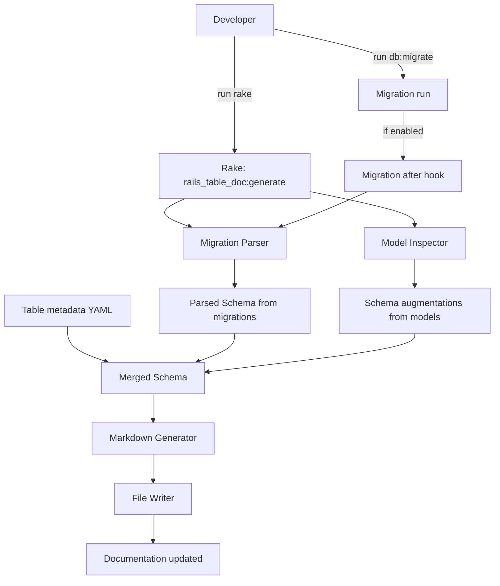
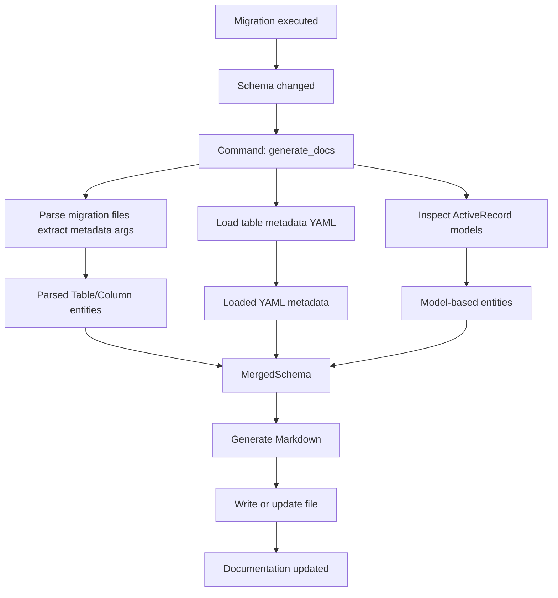

# External Design: User Stories and Event Storming

File: [`plans/external_design.md`](plans/external_design.md:1)

## Purpose

Explain how rails-table-doc integrates into a Rails project's workflow to keep table documentation up to date.

## Scope

- Source data: migration files and ActiveRecord models.
- Output: Markdown documentation of tables and columns.
- Integration: manual generation via a Rake task and optional automatic update after migrations (opt-in).

## User Stories

- As a developer, I run a single Rake task to generate table documentation.
- As a developer, documentation updates automatically after migrations when enabled.
- As a maintainer, I configure output path and include/exclude rules via a config file.
- As a contributor, code separates domain (Table/Column) from I/O (parsers/generators) for testability.

## Data Flow (updated)

- Extract schema information primarily from migration files.
- Allow migration definitions to contain metadata (e.g., logical names) as arguments for tables and columns.
- Store and manage table metadata as YAML (table info) that can be edited manually and merged with parsed schema.
- Optionally augment or override metadata via ActiveRecord model inspection.

## User Journey (Mermaid)

## Event Storming (Mermaid)

## Constraints and Notes

- Migration after hook is opt-in; disable in production environments by default.
- Migration files can contain metadata arguments; define a safe DSL for metadata to avoid eval risks.
- YAML store is the source of truth for human-managed metadata and is merged with parsed schema.
- Model inspection is optional and used for augmenting metadata only.

## Next Actions

- Define the migration metadata DSL and YAML schema for table info.
- Implement parsers to extract metadata from migrations safely (no eval).
- Implement merging rules (priority: YAML overrides parsed metadata, model augmentations supplement).
